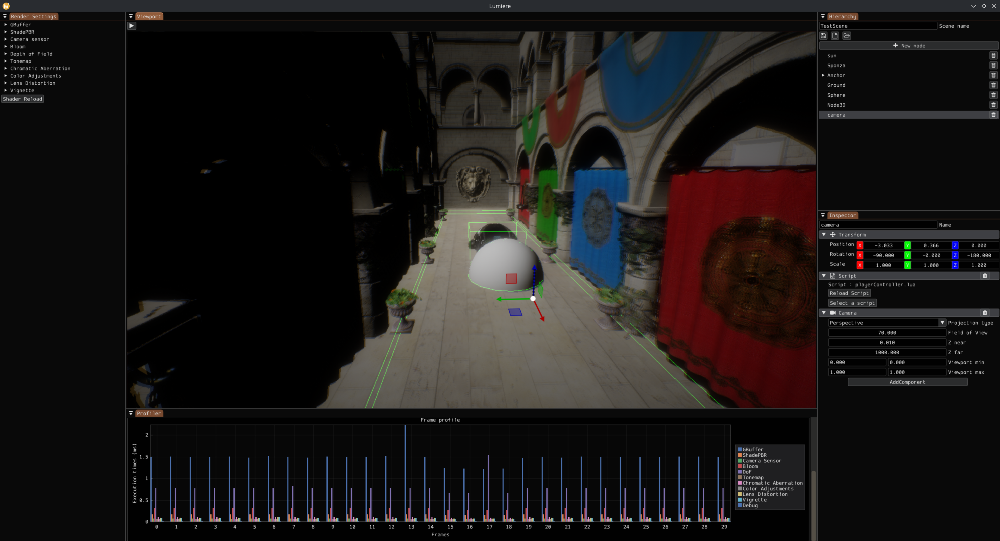

Sunlight is a game editor powered by the Lumiere rendering engine. 
Lumiere is linked as a submodule in /ext/Lumiere.



## Build and install
Clone the project and initialize the submodules to fetch the rendering engine: 
```c
cd path/to/Sunlight
git submodule init
git submodule update
```

Configure and build the CMake project using your method of choice, I've been working with Clion but Visual studio should work fine, as well as command line or CMake GUI.

In case of a crash on startup with errors related to YAML nodes, it is possible that an artifact of serialized pipeline made its way into some commits, so ensure there is no .YAML file in the bin/config folder. 

## Features
The Sunlight editor is quite barebones for now.
### Editor
- The Rendering panel lists all render passes and allows to visualize their outputs and their order, and allows to edit their configuration. You can also hot reload all the app shaders from here
- The Profiler panel profiles GPU frames and displays render times.
- The Hierarchy panel allows the creation of Nodes. Nodes are kind of like Godot nodes, GameObjects that can hold components. A scene is a hierarchy of Nodes.
- The Inspector panel gives details about the currently selected node. All nodes have a Transform component, and you can add up to 3 different component types as of now:
    - Mesh Renderer -> select a valid mesh file (gltf, obj, fbx...) using the "select file" button, and it will be drawn in the scene.
    - Light -> Select a light type using the dropdown and edit its parameters
    - Script -> Sunlight uses Lua as its scripting language! Select a .lua file. The script can be refreshed with the refresh button. More details below.
    - Camera -> When starting play mode, the first available camera is selected and will be used as the source of rendering
    - Rigidbody -> Defines a Physics object. It can be Dynamic, Kinematic or static, have a mass, frictions...
    - Colliders -> The shape of a Rigidbody during the physics simulation. All Rigidbodies MUST have a collider to be used by the physics simulation. For now, we only have Box and Sphere.

### Scripting
A script must be a Lua file. The engine will try to find functions and to run them at each Update tick: 
  - Update() is called each frame
  - Start() is called before the first update

ONLY THESE functions will be called automatically. In these functions, you can interact with the engine components. For instance,
you can get the Transform of the Node owning the script with ```node.transform```. Any change on this object will be reflected on the C++ side.
Since i don't have documentation yet, check the ScriptEngine class, the Node3D class and the Component classes (Lumiere/Components/*.cpp) to learn what type is registered to the lua 
context, and which methods are available in the script runtime. 

As an example, this script tries to find a MeshRenderer on start, and displays its name if there is one, 
then moves the Node along a circular path each update:
```lua
local elapsed = 0

function Start()
    print("starting")
    local m = node:GetMeshComponent()
    if(m == false) then
        print("No mesh found")
    else
        print(m.mesh:name())
    end
end

function Update(dt)
    local t = node.transform
    t.position = vec3(0, math.sin(elapsed), math.cos(elapsed))
    elapsed = elapsed + dt
end
```

A few scripting tips and tricks:
- Since we don't have any serializable parameters in the editor yet, passing object references around is a bit tricky. A workaround is to use Events or Messages to pass data around, in an observer pattern fashion: 
```lua
-- in the "provider" script, send an event with the script Node as payload
function Start()
    Events.Emit("CameraRegistered", node)
end

-- in the "consumer" script, declare a variable, subscribe to the event emitted above and a callback on event reception.
-- You now have a reference to the other object node! Note that depending on script update order,
-- a few errors might occur on the first frame.
local camera
function Start()
    Events.Subscribe("CameraRegistered", OnCameraRegistered)
end

function OnCameraRegistered(node)
    camera = node
end
```

## Interactions
You can move in the editor viewport with ZQSD, with A/E to move up/down. Hold alt to rotate the view.

The rendering settings can be changed at runtime and will be saved upon application closure. To restore the default parameters,
delete the YAML files in the bin/config folder.

The Sunlight default app packages two different view: Photorealistic and Cartoony. Switch between the 2 with `RenderSettings.activePipeline = (pipelineId)` in scripts, or in the CPP side using the RenderSettings object owned by Sunlight.